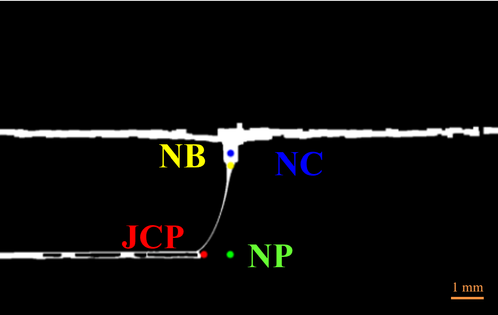

# MEW Jet Lag Quantification

The MEW Jet Lag Quantification project is a Python-based tool developed for the Biomaterials Processing and Design Group at the TU/e. It utilizes a linear search algorithm using OpenCV to analyze videos and quantify the jet lag in additive manufacturing processes.

  

## Project Structure

The project structure consists of the following components:

- **lib/**: Contains the main algorithm for jet lag quantification.
  - `utils.py`: Includes three classes:
    - `debugging class`: Provides debugging functionality for plotting various parts of the algorithm.
    - `video class`: Initializes the OpenCV video and implements basic functionality such as frame rotation, segmentation techniques, and nozzle diameter detection.
    - `jetlag class`: Calculates the jet lag distance in pixels and converts it to millimeters using nozzle calibration. Also determines search height, bottom of the nozzle, and collector plate height.
  - `Jet_Vibrations_Analysis.py`: Performs analysis on nozzle vibration within a frame.
  - `Jet_Segmentation.py`: Implements segmentation techniques on the jet.
  
- **env/environment.yml**: Describes the project's environment and dependencies in a YAML file.
  
- `SquaresAnalysis.py`: Quantifies jet lag for a specific frame range in a given video.

- **Vibrations.py**: Analyzes a given video series and generates plots for normalized pixel change, helping in vibration analysis.

- **SquaresAnalysis.py**: Quantifies jet lag for a specific frame range in a given video.

- **JetLag_Full_Video.py**: Applies the algorithm to analyze a complete video and plots the jet lag over time.

## Installation and Usage

Please refer to the [env](env/) section for detailed instructions on setting up the project environment and installing dependencies. Once the project is set up, you can use the provided scripts to perform specific analyses on your videos.

## License

This project is licensed under the [MIT License](LICENSE).

Feel free to modify and adapt the code according to your needs.

For any questions or support, please contact me at t.c.v.hattem@student.tue.nl.
